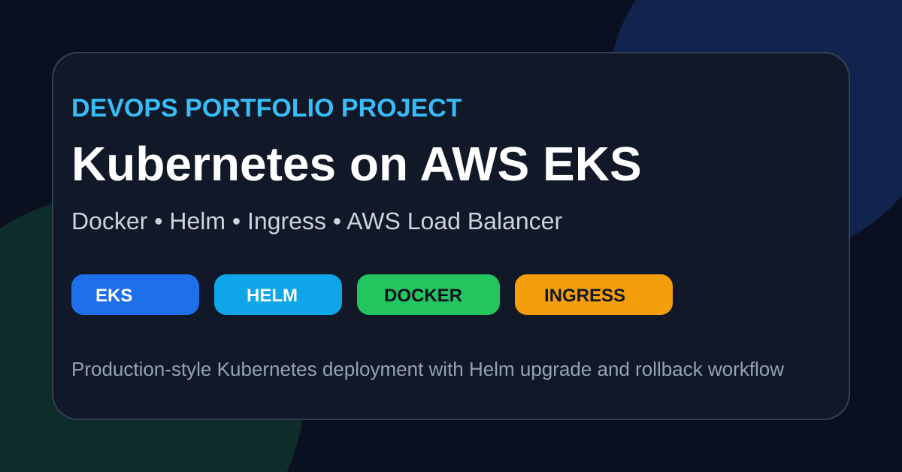
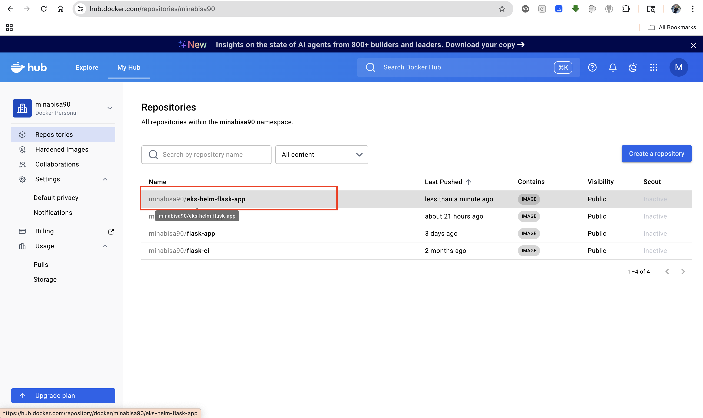
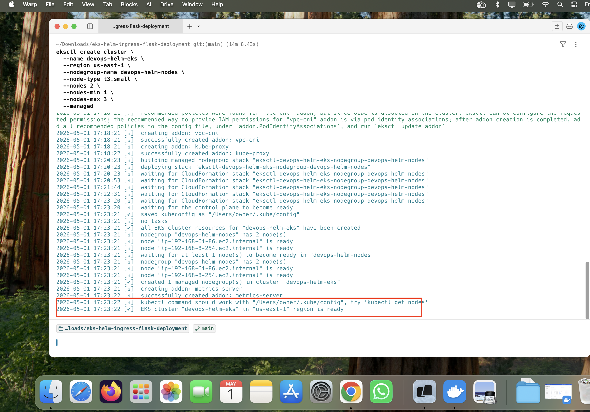
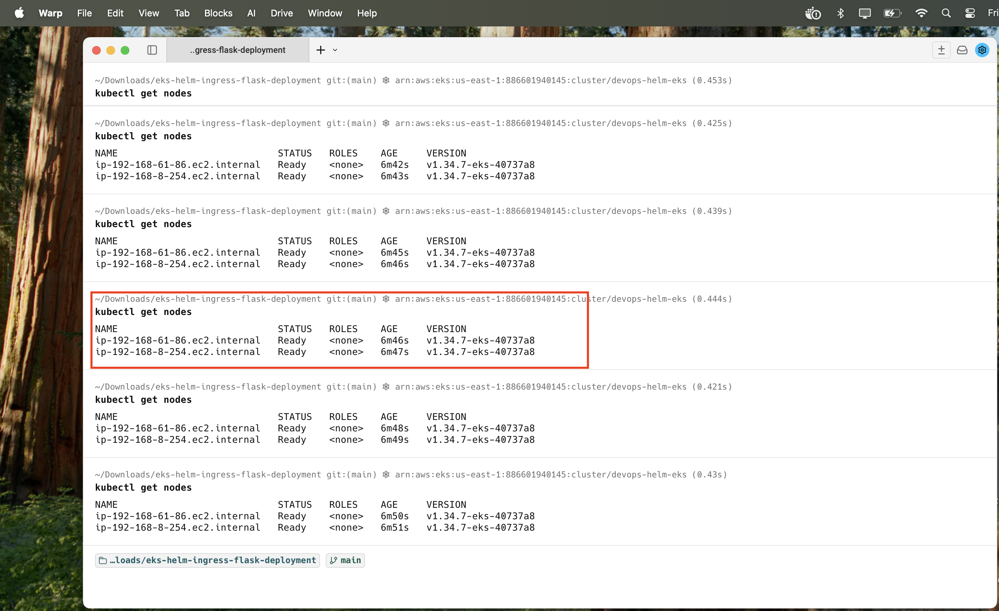
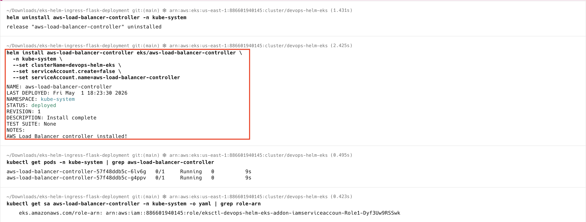
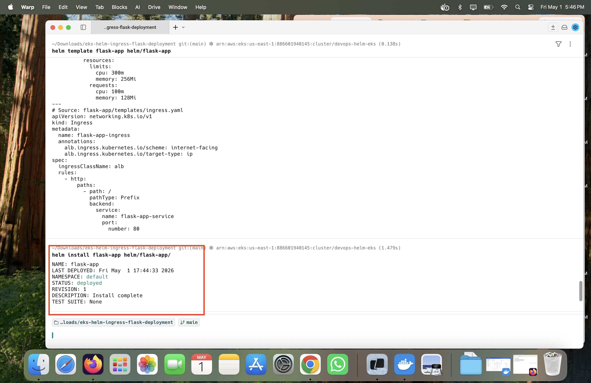
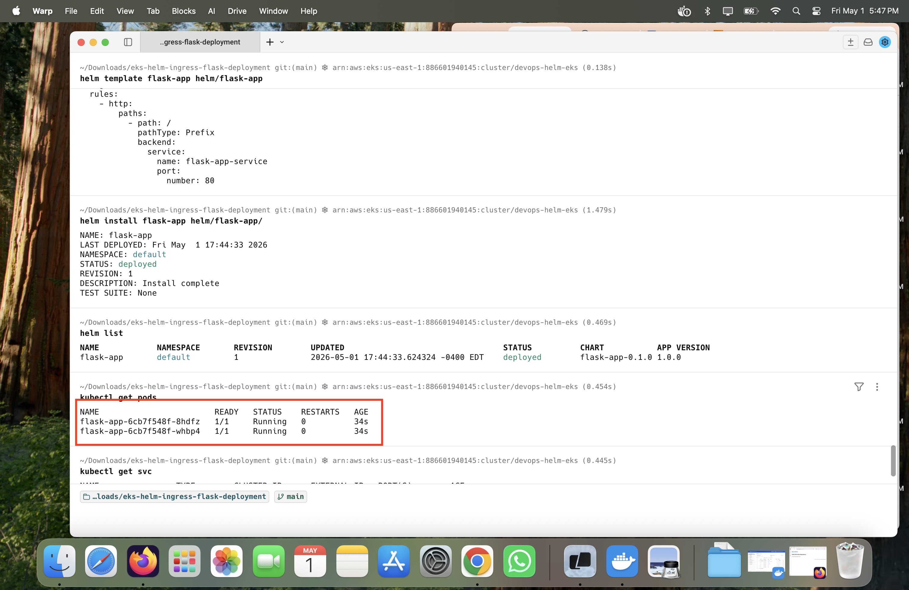
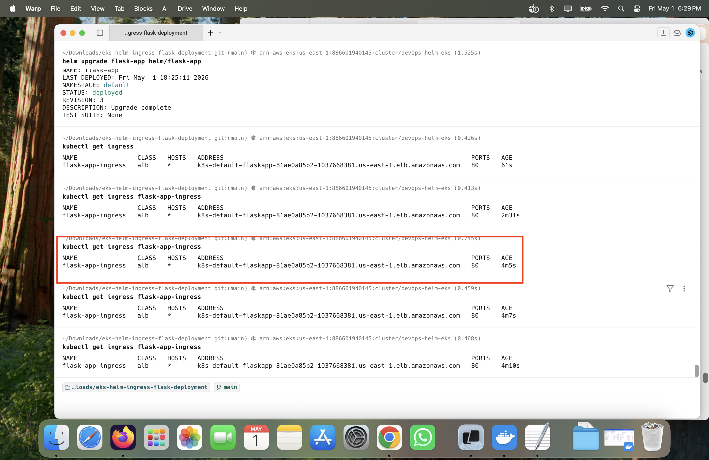
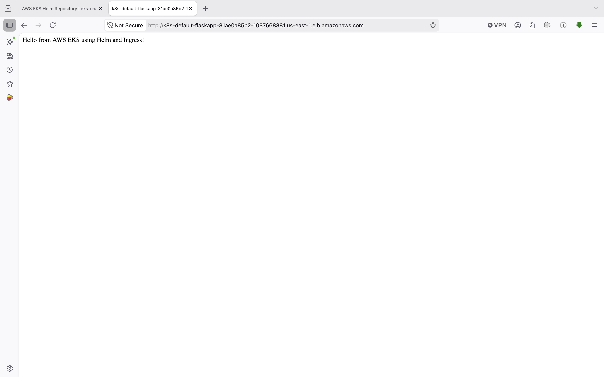

# 🚀 EKS Helm Ingress Flask Deployment



## 📌 Project Overview

This project demonstrates a professional cloud-native deployment workflow using **AWS EKS, Kubernetes, Helm, Docker, and AWS Load Balancer Controller**.

The application is a simple Python Flask app that is containerized with Docker, pushed to DockerHub, deployed to an Amazon EKS Kubernetes cluster using Helm, and exposed publicly through an AWS Application Load Balancer using Kubernetes Ingress.

---

## 🛠️ Tools & Technologies

- **AWS EKS** – Managed Kubernetes cluster
- **Kubernetes** – Container orchestration
- **Helm** – Kubernetes package manager
- **Docker** – Containerization
- **DockerHub** – Container image registry
- **AWS Load Balancer Controller** – ALB integration with Kubernetes Ingress
- **AWS CLI** – AWS authentication and configuration
- **eksctl** – EKS cluster provisioning
- **Python Flask** – Web application
- **Git & GitHub** – Version control and project hosting

---

## 🧠 Architecture

```text
Developer
   ↓
Docker Buildx
   ↓
DockerHub Image Registry
   ↓
Amazon EKS Cluster
   ↓
Helm Release
   ↓
Kubernetes Deployment + Service
   ↓
Ingress
   ↓
AWS Application Load Balancer
   ↓
Public Web Application
```

---

## 📂 Project Structure

```text
eks-helm-ingress-flask-deployment/
│
├── app/
│   ├── app.py
│   ├── requirements.txt
│   └── Dockerfile
│
├── helm/
│   └── flask-app/
│       ├── Chart.yaml
│       ├── values.yaml
│       └── templates/
│           ├── deployment.yaml
│           ├── service.yaml
│           └── ingress.yaml
│
├── images/
│   ├── project-banner.png
│   ├── dockerhub.png
│   ├── eks-cluster.png
│   ├── nodes.png
│   ├── alb-controller.png
│   ├── helm-release.png
│   ├── pods.png
│   ├── ingress.png
│   └── app-browser.png
│
├── README.md
└── .gitignore
```

---

## ⚙️ Deployment Steps

### 1️⃣ Build and Push Docker Image

Run from the `app/` directory:

```bash
cd app

docker buildx build \
  --platform linux/amd64 \
  -t minabisa90/eks-helm-flask-app:latest \
  --push .

cd ..
```

> The `linux/amd64` platform is important because EKS worker nodes commonly run AMD64 architecture.

---

### 2️⃣ Create EKS Cluster

```bash
eksctl create cluster \
  --name devops-helm-eks \
  --region us-east-1 \
  --nodegroup-name devops-helm-nodes \
  --node-type t3.small \
  --nodes 2 \
  --nodes-min 1 \
  --nodes-max 3 \
  --managed
```

---

### 3️⃣ Configure kubectl

```bash
aws eks update-kubeconfig \
  --region us-east-1 \
  --name devops-helm-eks
```

Verify connection:

```bash
kubectl get nodes
```

---

### 4️⃣ Install AWS Load Balancer Controller

Associate IAM OIDC provider:

```bash
eksctl utils associate-iam-oidc-provider \
  --region us-east-1 \
  --cluster devops-helm-eks \
  --approve
```

Create IAM policy:

```bash
curl -O https://raw.githubusercontent.com/kubernetes-sigs/aws-load-balancer-controller/v2.14.1/docs/install/iam_policy.json

aws iam create-policy \
  --policy-name AWSLoadBalancerControllerIAMPolicy \
  --policy-document file://iam_policy.json
```

Create IAM service account:

```bash
eksctl create iamserviceaccount \
  --cluster=devops-helm-eks \
  --namespace=kube-system \
  --name=aws-load-balancer-controller \
  --attach-policy-arn=arn:aws:iam::<ACCOUNT_ID>:policy/AWSLoadBalancerControllerIAMPolicy \
  --override-existing-serviceaccounts \
  --region us-east-1 \
  --approve
```

Add Helm repo:

```bash
helm repo add eks https://aws.github.io/eks-charts
helm repo update
```

Install controller:

```bash
helm upgrade --install aws-load-balancer-controller eks/aws-load-balancer-controller \
  -n kube-system \
  --set clusterName=devops-helm-eks \
  --set serviceAccount.create=false \
  --set serviceAccount.name=aws-load-balancer-controller
```

Verify:

```bash
kubectl get pods -n kube-system | grep aws-load-balancer-controller
kubectl get sa aws-load-balancer-controller -n kube-system -o yaml | grep role-arn
```

---

### 5️⃣ Deploy Application with Helm

```bash
helm lint ./helm/flask-app
helm install flask-app ./helm/flask-app
```

Verify release:

```bash
helm list
kubectl get pods
kubectl get svc
kubectl get ingress
```

---

### 6️⃣ Access Application

Get the Ingress address:

```bash
kubectl get ingress flask-app-ingress
```

Open in browser:

```text
http://<ALB-DNS-NAME>
```

---

## 🔄 Helm Upgrade Example

Update the app, build a new image tag, then upgrade with Helm:

```bash
cd app

docker buildx build \
  --platform linux/amd64 \
  -t minabisa90/eks-helm-flask-app:v2 \
  --push .

cd ..
```

Upgrade release:

```bash
helm upgrade flask-app ./helm/flask-app --set image.tag=v2
```

Check rollout:

```bash
kubectl rollout status deployment/flask-app
helm history flask-app
```

---

## ↩️ Helm Rollback Example

```bash
helm rollback flask-app 1
helm history flask-app
```

---

## 📸 Project Screenshots

### 🐳 Docker Image on DockerHub


### ☁️ EKS Cluster Created


### ⚙️ Kubernetes Nodes Ready


### 🔐 AWS Load Balancer Controller Running


### 📦 Helm Release Installed


### 🚀 Pods Running Successfully


### 🌐 Kubernetes Ingress with ALB Address


### ✅ Application Running in Browser


---

## 🧪 Useful Commands

### Check nodes
```bash
kubectl get nodes
```

### Check pods
```bash
kubectl get pods
```

### Describe pod
```bash
kubectl describe pod <pod-name>
```

### Check services
```bash
kubectl get svc
```

### Check ingress
```bash
kubectl get ingress
```

### Check Helm releases
```bash
helm list
```

### Check ALB controller logs
```bash
kubectl logs -n kube-system deployment/aws-load-balancer-controller --tail=50
```

---

## 🔐 Security & Best Practices

- No AWS credentials stored in the repository
- Docker image built for EKS-compatible architecture using `linux/amd64`
- AWS Load Balancer Controller uses IAM service account instead of node role
- Kubernetes manifests managed with Helm templates
- Application includes health endpoint for readiness and liveness probes
- Sensitive files excluded using `.gitignore`

---

## 🧹 Cleanup

To avoid AWS charges, delete the Helm release and EKS cluster when finished:

```bash
helm uninstall flask-app

eksctl delete cluster \
  --name devops-helm-eks \
  --region us-east-1
```

---

## 🎯 Key Learnings

- Created and managed an AWS EKS cluster
- Built and pushed Docker images for Kubernetes workloads
- Deployed applications using Helm charts
- Configured Kubernetes Deployment, Service, and Ingress resources
- Integrated AWS Load Balancer Controller with Kubernetes Ingress
- Performed Helm upgrade and rollback operations
- Troubleshot real-world Kubernetes image pull and IAM permission issues

---

## 🚀 Future Improvements

- Add GitHub Actions CI/CD pipeline
- Add HTTPS using AWS ACM certificate
- Add Route 53 custom domain
- Add Prometheus and Grafana monitoring
- Add Horizontal Pod Autoscaler
- Add production namespace separation

---

## 👨‍💻 Author

**Mina Bisa**

- GitHub: https://github.com/minabisa90
- LinkedIn: https://linkedin.com/in/mina-bisa

---

## ⭐ Support

If you like this project, consider giving it a ⭐ on GitHub!
